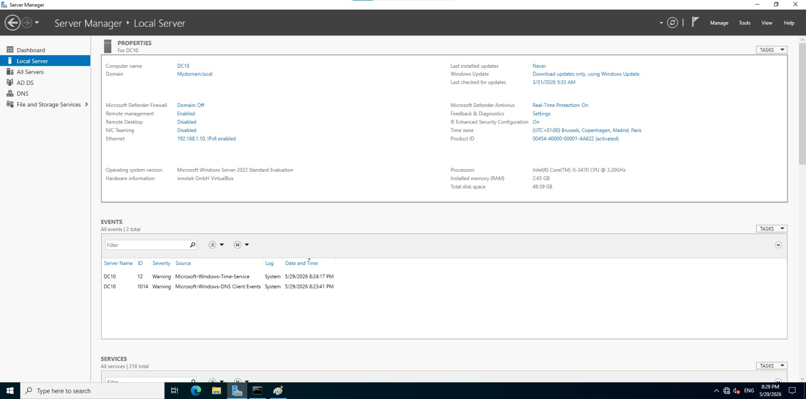

# Active Directory Home Lab Infrastructure

## Project Overview

This project demonstrates the deployment and administration of a Windows Server 2022 Active Directory environment within a home lab. The objective was to simulate a real world enterprise identity infrastructure by installing Active Directory Domain Services (AD DS), configuring DNS, creating organizational units, managing users and groups, and preparing the environment for workstation domain joins.

## Environment

## Virtual Machines

| Machine |      Operating System |       Purpose |
|---------------|-----------------------|----------------|
| DC10 | Windows Server 2022 | Domain Controller |
| WorkLab2 | Windows 10 | Client Workstation | 

## Domain Information

- Domain Name: mydomain.local
- Domain Controller IP: 192.168.1.10
- DNS Server: 192.168.1.10

# Step 1 Install Windows Server 2022

A Windows Server 2022 virtual machine was deployed using Oracle VirtualBox.

## Tasks Performed

- Created new VM
- Allocated memory and storage
- Installed Windows Server 2022
- Configured administrator password
  
### Screenshot

# Step 2 Configure Static IP Address

A static IP address was assigned to ensure consistent communication within the lab environment.

## Configuration

| Setting	| Value |
|------------------|-----------------|
| IP Address |	192.168.1.10 |
| Subnet Mask |	255.255.255.0 |
| Default Gateway	| 192.168.1.1 |
| Preferred DNS |	192.168.1.10 |

### Screenshot

# Step 3 Install Active Directory Domain Services

The Active Directory Domain Services role was installed using Server Manager.

## Tasks Performed

- Opened Server Manager
- Selected Add Roles and Features
- Installed Active Directory Domain Services
- Installed required features

### Screenshot

