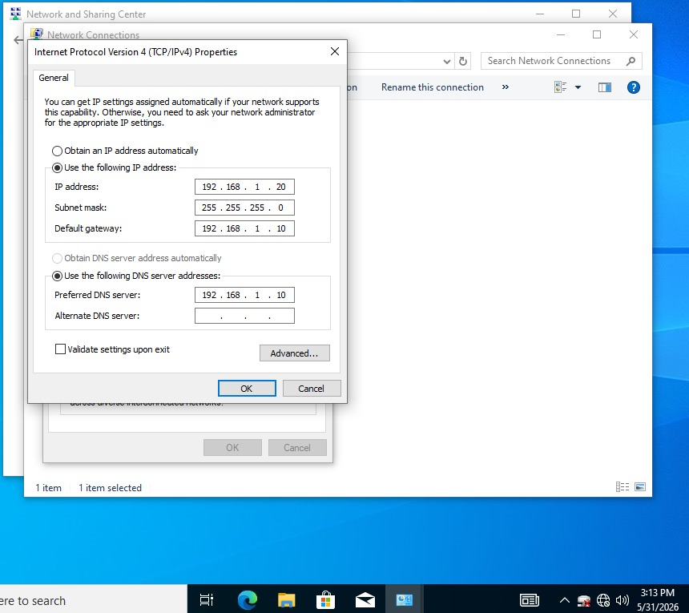
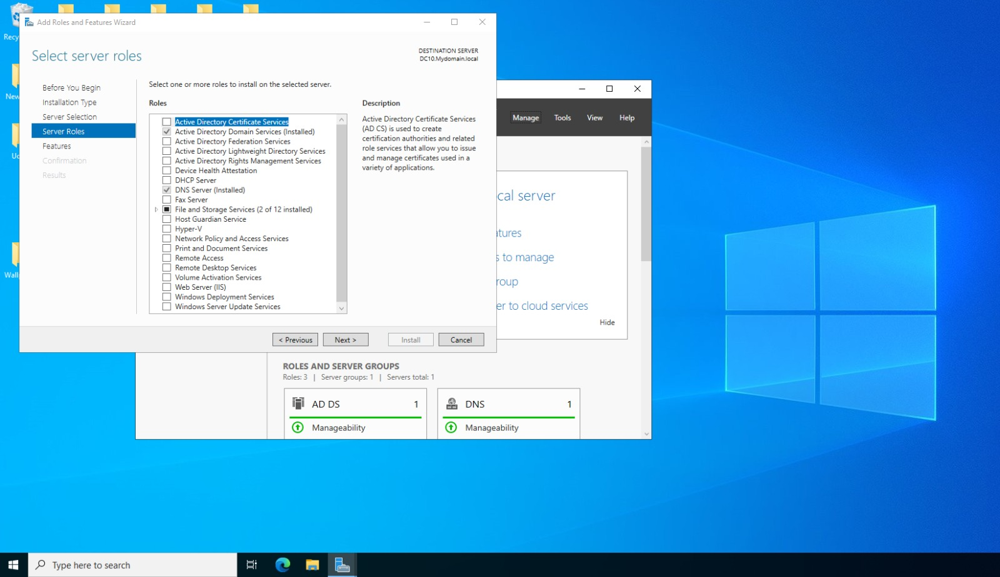

# Active Directory Home Lab Infrastructure

## Project Overview

This project demonstrates the deployment and administration of a Windows Server 2022 Active Directory environment within a home lab. The objective was to simulate a real world enterprise identity infrastructure by installing Active Directory Domain Services (AD DS), configuring DNS, creating organizational units, managing users and groups, and preparing the environment for workstation domain joins.

## Environment

## Virtual Machines

| Machine |      Operating System |       Purpose |
|---------------|-----------------------|----------------|
| DC10 | Windows Server 2022 | Domain Controller |
| WorkLab2 | Windows 10 | Client Workstation | 

## Domain Information

- Domain Name: mydomain.local
- Domain Controller IP: 192.168.1.10
- DNS Server: 192.168.1.10

# Step 1 Install Windows Server 2022

A Windows Server 2022 virtual machine was deployed using Oracle VirtualBox.

## Tasks Performed

- Created new VM
- Allocated memory and storage
- Installed Windows Server 2022
- Configured administrator password
  
### Screenshot

# Step 2 Configure Static IP Address

A static IP address was assigned to ensure consistent communication within the lab environment.

## Configuration

| Setting	| Value |
|------------------|-----------------|
| IP Address |	192.168.1.10 |
| Subnet Mask |	255.255.255.0 |
| Default Gateway	| 192.168.1.1 |
| Preferred DNS |	192.168.1.10 |

### Screenshot

# Step 3 Install Active Directory Domain Services

The Active Directory Domain Services role was installed using Server Manager.

## Tasks Performed

- Opened Server Manager
- Selected Add Roles and Features
- Installed Active Directory Domain Services
- Installed required features

### Screenshot

# Step 4 Promote Server to Domain Controller

After installing AD DS, the server was promoted to a Domain Controller.

## Tasks Performed

- Selected Promote this server to a domain controller
- Created a new forest
- Created domain: mydomain.local
- Configured Directory Services Restore Mode (DSRM) password
  
### Screenshot

### Screenshot

# Step 5 Verify Active Directory Installation

Verified that Active Directory was successfully deployed.

## Verification

Opened:
- Active Directory Users and Computers
- Active Directory Administrative Center
- DNS Manager

### Screenshot

### Screenshot

# Step 6 Create Organizational Units (OUs)

Organizational Units were created to simulate departmental structure.

## OUs Created

- HR
- IT
- Sales

## Purpose

OUs provide logical separation and simplify policy administration.

### Screenshot

# Step 7 Create Users

Test users were created to simulate employee accounts.

## Tasks Performed

- Created user accounts
- Assigned passwords
- Enabled accounts

### Screenshot

# Step 8 Create Security Groups

Security groups were created for access management.

## Groups Created

- HR_Group
- IT_Group

## Purpose

Groups simplify permission assignment and support Role Based Access Control (RBAC).

### Screenshot

# Step 9 Configure DNS

DNS functionality was verified to ensure domain name resolution.

## Validation Commands

cmd
nslookup mydomain.local
ping dc10.mydomain.local

## Result

Successful DNS resolution confirmed correct domain functionality.

### Screenshot

# Project Outcome

Successfully deployed a functioning Active Directory environment capable of supporting:

- User management
- Group management
- DNS resolution
- Organizational Units
- Authentication services
- Future workstation domain joins

The environment now serves as the foundation for additional projects involving Group Policy, file sharing, permissions management, and Microsoft Entra ID integration.
