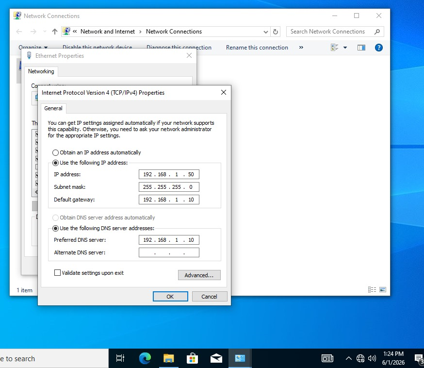
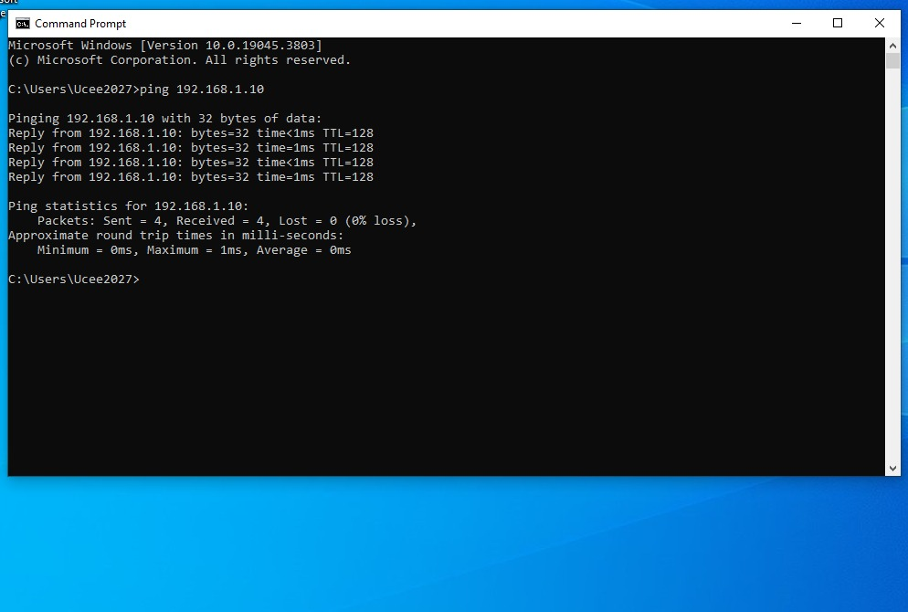
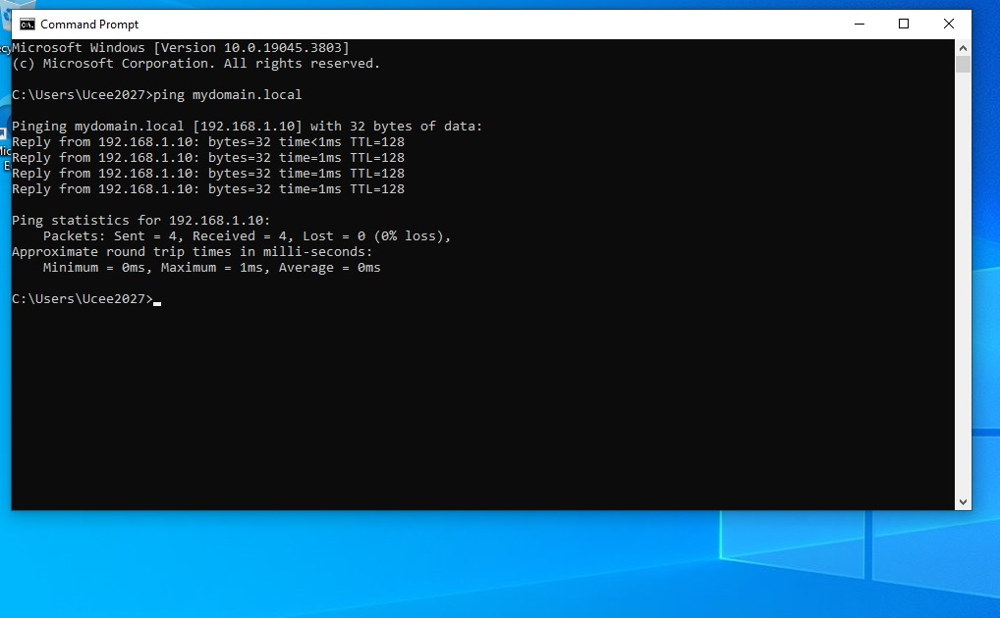
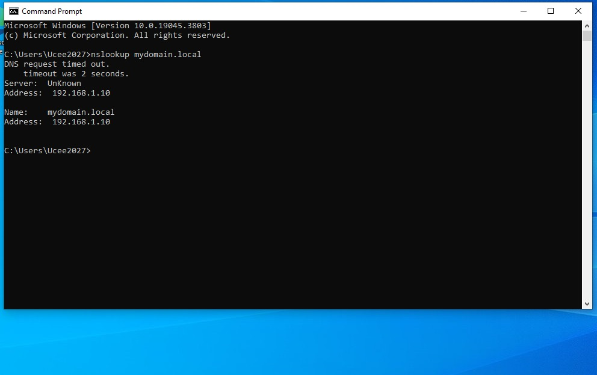
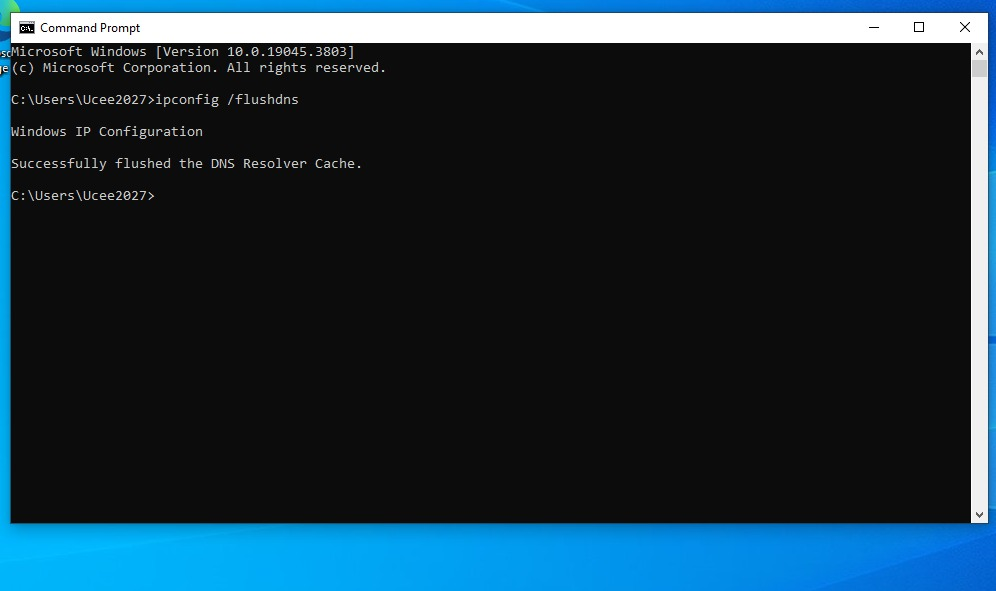
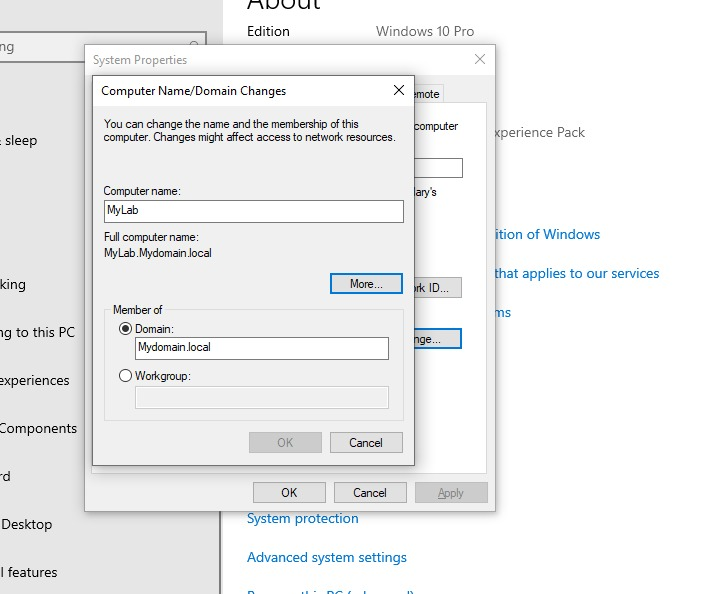
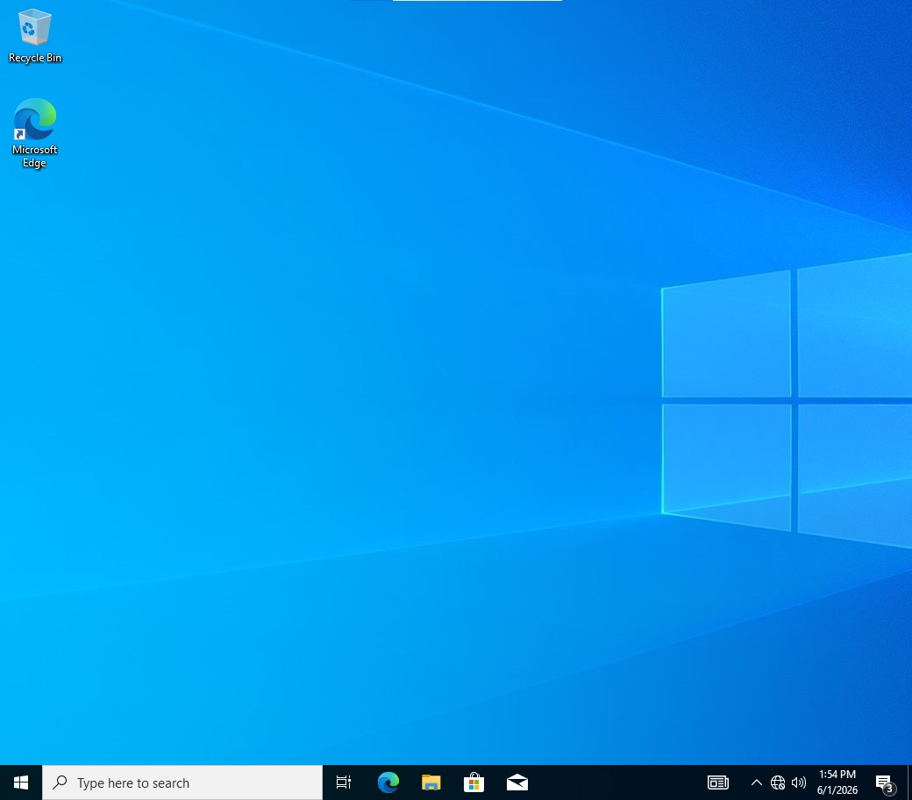
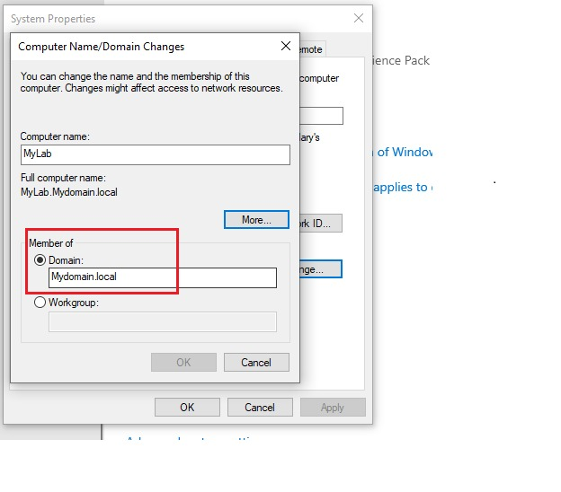

# Windows 10 Domain Join & Network Configuration

## Project Overview

This project demonstrates the configuration of a Windows 10 client workstation and its successful integration into an Active Directory domain environment. The objective was to configure network settings, verify connectivity to the Domain Controller, troubleshoot DNS resolution, and join the workstation to the domain.

## Environment

## Virtual Machines

| Machine | Operating System | Purpose |
|-------------|--------------|---------------|
| DC10	| Windows Server 2022	| Domain Controller |
| WorkLab2 |	Windows 10	| Client Workstation |

## Network Configuration

| Setting	| Value |
|-------------|-----------------|
| Domain Name |	mydomain.local |
| Domain Controller IP |	192.168.1.10 |
| Workstation IP |	192.168.1.50 |
| DNS Server	| 192.168.1.10 |

# Step 1 Configure Static IP Address

A static IP address was assigned to the workstation to ensure reliable communication with the Domain Controller.

## Configuration

| Setting	| Value |
|--------------|---------------|
| IP Address	| 192.168.1.50 |
| Subnet Mask	| 255.255.255.0 |
| Default Gateway |	192.168.1.1 |
| Preferred DNS	| 192.168.1.10 |

### Screenshot

### Screenshot

# Step 2 Verify Network Connectivity

Network communication between the workstation and Domain Controller was verified.

## Validation Commands

- cmd
- ping 192.168.1.10
- ping dc10
- ping mydomain.local

### Result

The workstation successfully communicated with the Domain Controller.

### Screenshot

### Screenshot

# Step 3 Verify DNS Resolution

DNS was tested to ensure the workstation could locate domain resources.

## Validation Command

- cmd
- nslookup mydomain.local

### Result

DNS successfully resolved the domain and returned the Domain Controller information.

### Screenshot

# Step 4 Troubleshoot Network Configuration

Network settings were reviewed and validated before attempting to join the domain.

## Commands Used

- cmd
- ipconfig
- ipconfig /all
- ipconfig /flushdns
- ipconfig /release
- ipconfig /renew

### Purpose

These commands were used to:
- Verify network settings
- Refresh IP configuration
- Clear DNS cache
- Troubleshoot connectivity issues

### Screenshot

# Step 5 Join Workstation to Domain

The workstation was joined to the Active Directory domain.

## Tasks Performed

- Opened System Properties
- Selected Change Settings
- Chose Domain
- Entered mydomain.local
- Supplied domain administrator credentials

### Result

The workstation successfully joined the domain.

### Screenshot

# Step 6 Restart Workstation

The workstation was restarted to complete domain membership.

### Purpose

A restart was required for the domain join process to take effect.

# Step 7 Verify Domain Authentication

Successfully authenticated using a domain account.

## Tasks Performed

- Logged in with domain credentials
- Verified communication with Domain Controller
- Confirmed domain membership

### Example Login

mydomain\username

### Screenshot

### Screenshot

# Step 8 Verify Domain Membership

Confirmed that the workstation was successfully joined to the domain.

### Verification

Opened:
- System Properties
- Confirmed:
- Domain: mydomain.local
- Screenshot Required

### Screenshot

## Project Outcome

Successfully configured a Windows 10 workstation and integrated it into an Active Directory environment.

### The workstation was able to:
- Communicate with the Domain Controller
- Resolve DNS records
- Authenticate against Active Directory
- Join and operate within the domain
- Support centralized user management

