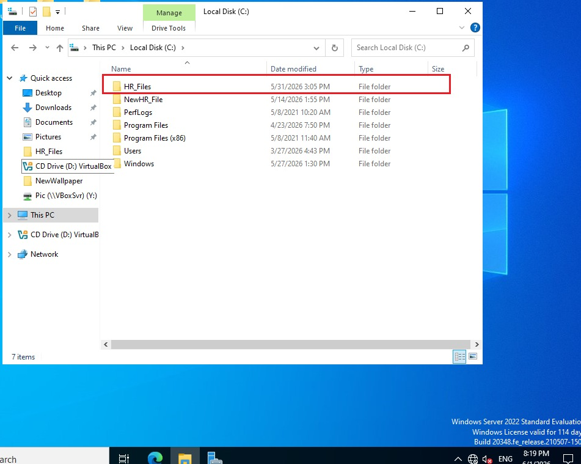
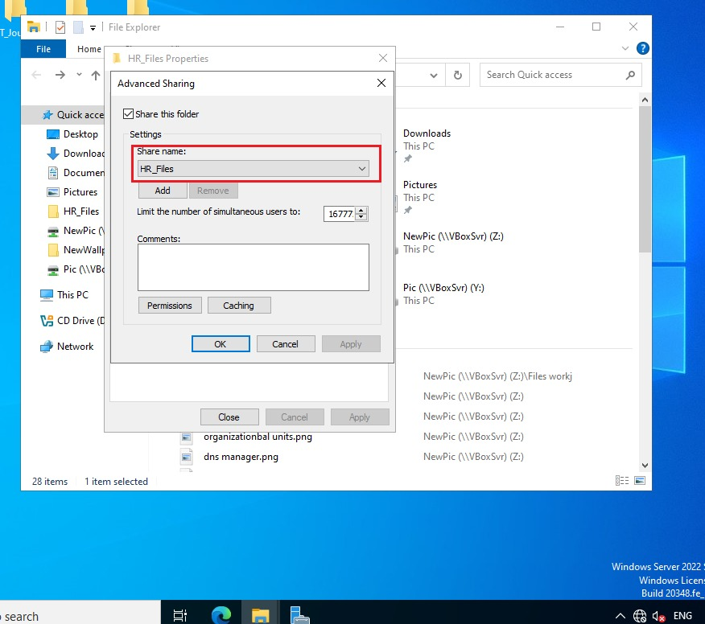
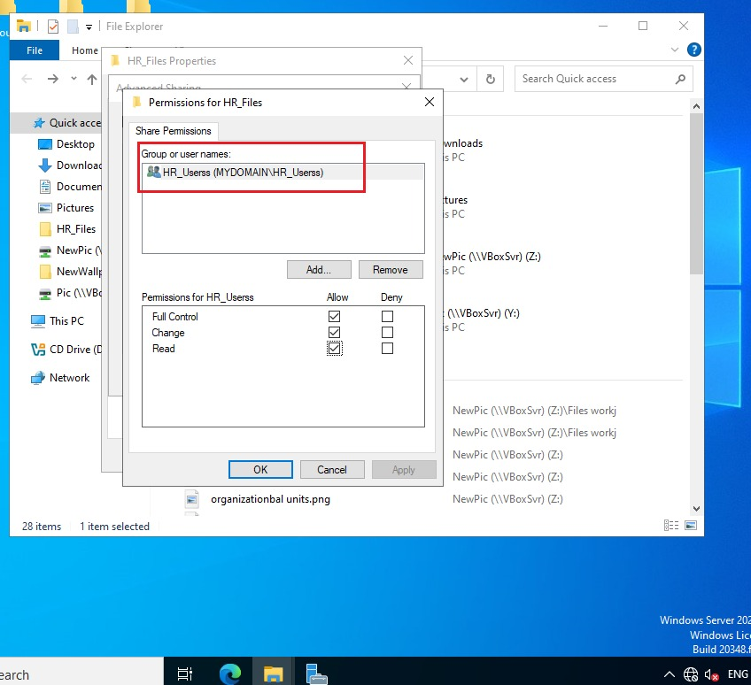
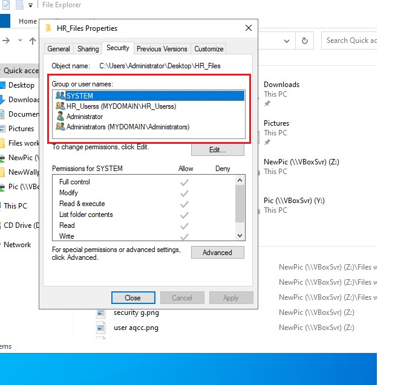
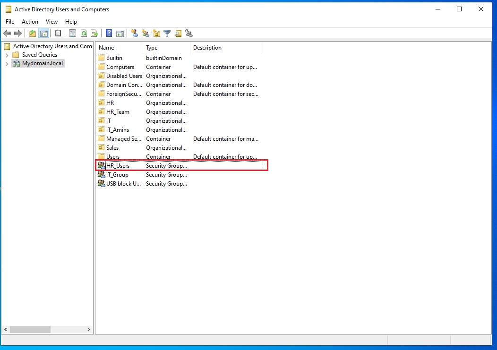
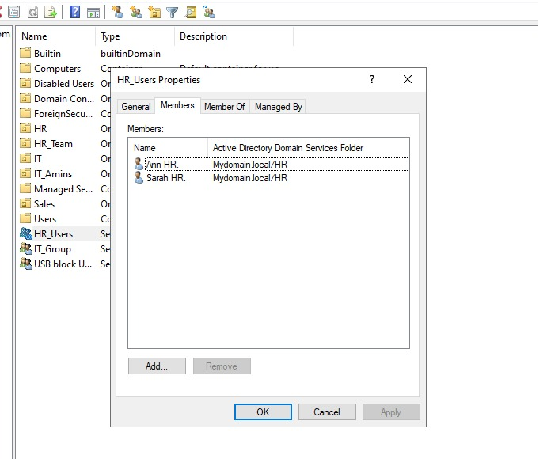
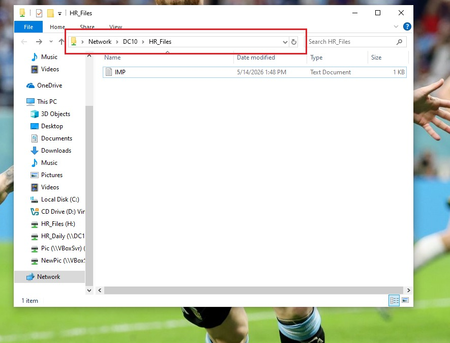
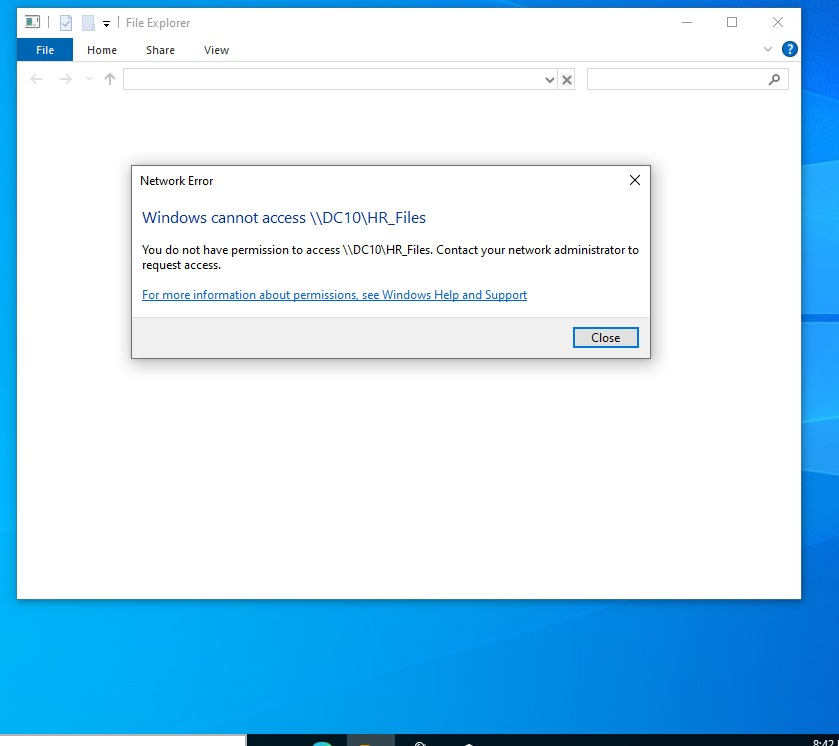

# File Server & Access Management

## Project Overview

This project demonstrates the deployment and management of shared network resources within a Windows Server Active Directory environment. The objective was to create departmental file shares, configure access permissions, implement Role Based Access Control (RBAC), and verify secure access using Active Directory security groups.

## Environment

### Infrastructure

| Component |	Description |
|----------------|-----------------|
| Domain Controller	| DC10 |
| Operating System	| Windows Server 2022 |
| Domain	| mydomain.local |
| Client Workstation |	WorkLab2 |
| Active Directory |	Configured |

## Step 1 Create Shared Folder

A shared folder was created to simulate departmental file storage.

### Folder Created

C:\HR_Files

### Purpose

The folder was created to provide centralized file storage for HR users.

### Screenshot

## Step 2 Configure Network Share

The folder was shared on the network.

### Tasks Performed

- Opened Folder Properties
- Selected Sharing tab
- Opened Advanced Sharing
- Enabled Share this folder
- Assigned share name

### Share Name

HR_Files

### Screenshot

## Step 3 Configure Share Permissions

Share permissions were configured to control network level access.

### Tasks Performed

- Opened Share Permissions
- Reviewed existing permissions
- Configured access for authorized users

### Purpose

Share permissions determine who can access the shared folder across the network.

### Screenshot

## Step 4 Configure NTFS Permissions

NTFS permissions were configured to control file system access.

### Tasks Performed

- Opened Security tab
- Reviewed inherited permissions
- Configured folder access

### Permissions Retained

- SYSTEM
- Administrators
- Administrator

### Permissions Added

HR_Userss

### Purpose

NTFS permissions provide granular control over folder access and actions.

### Screenshot

## Step 5 Create Security Group

A security group was created within Active Directory.

### Group Created

HR_Userss

### Purpose

The group was used to simplify permission assignment and support Role Based Access Control (RBAC).

### Screenshot

## Step 6 Assign Users to Security Group

Users were assigned to the HR security group.

### Tasks Performed

- Opened Active Directory Users and Computers
- Opened HR_Group properties
- Added HR users

### Purpose

Group membership automatically grants access to resources assigned to the group.

### Screenshot

## Step 7 Verify Access from Client Workstation

Access was tested from a domain joined workstation.

### Test Path

\\DC10\HR_Files

### Verification

- HR user successfully accessed folder
- Folder opened without errors

### Screenshot

## Step 8 Verify Access Restrictions

Access control was validated using unauthorized accounts.

### Verification
- Non-HR users tested
- Access restrictions confirmed

### Result

Only authorized users were able to access HR resources.

### Screenshot

## Step 9 Understand Effective Permissions

Permission inheritance and effective access were reviewed.

### Concepts Practiced

- Share Permissions
- NTFS Permissions
- Permission Inheritance
- Effective Permissions
- RBAC

### Purpose

Understanding how permissions combine is critical for troubleshooting access related issues.

## Project Outcome

Successfully deployed a secure file sharing solution within an Active Directory environment.

### The implementation provided:

- Centralized file storage
- Department based access control
- Security group management
- NTFS permission management
- Share permission management
- Role Based Access Control (RBAC)

