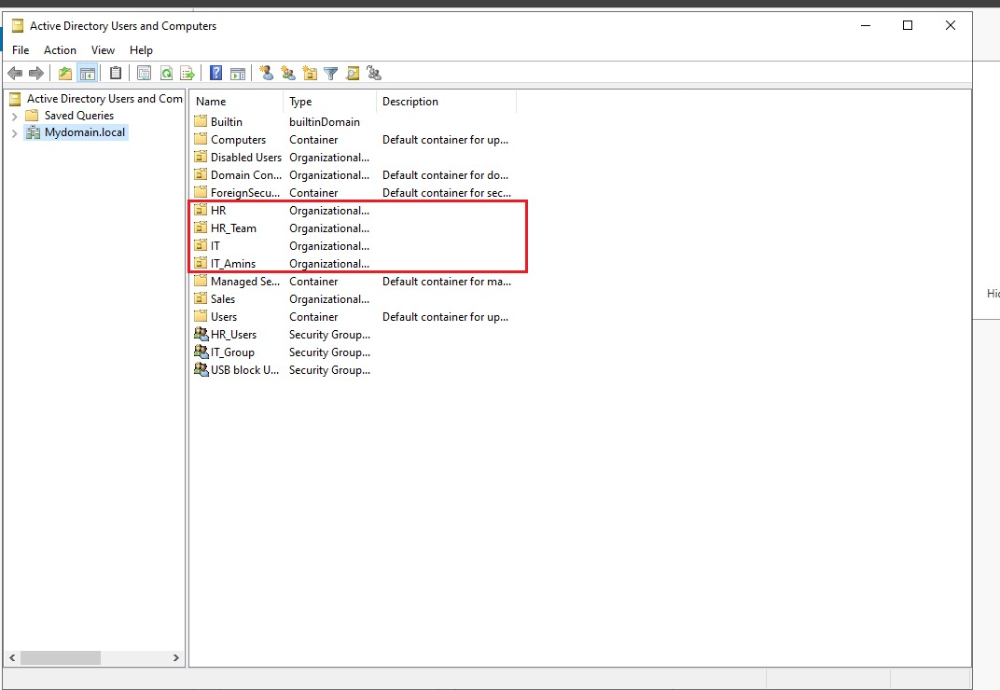
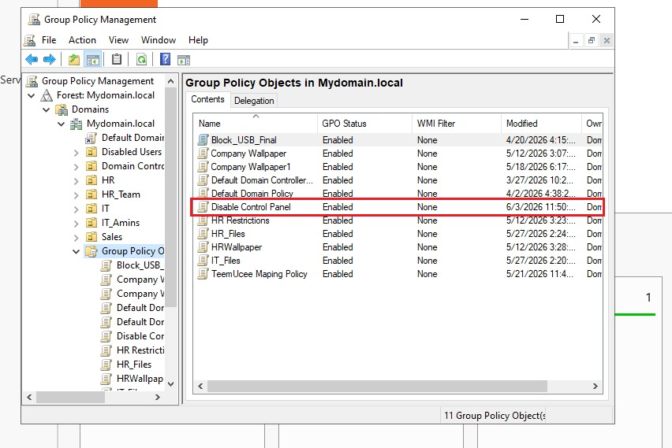
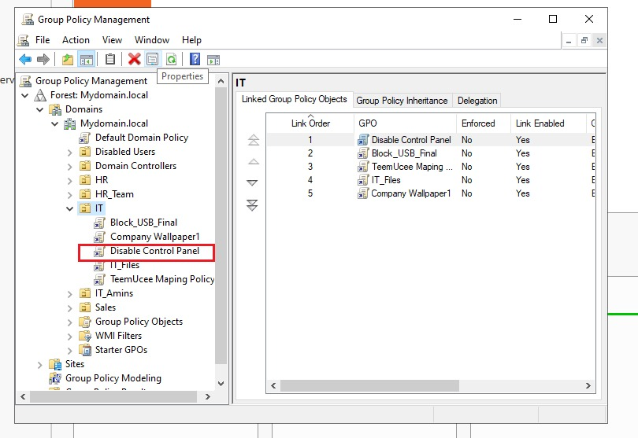
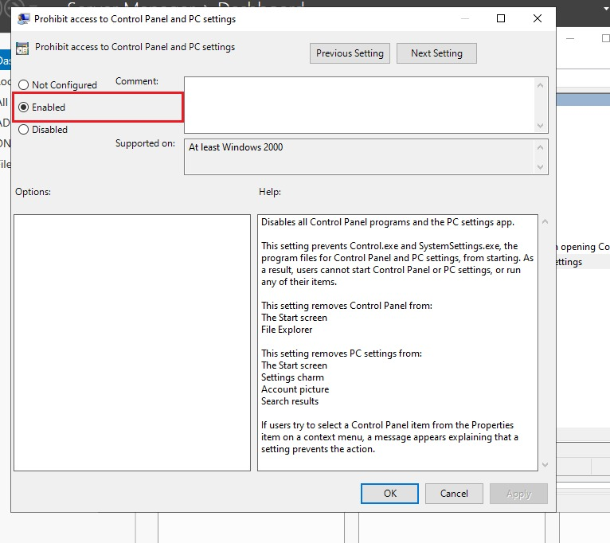
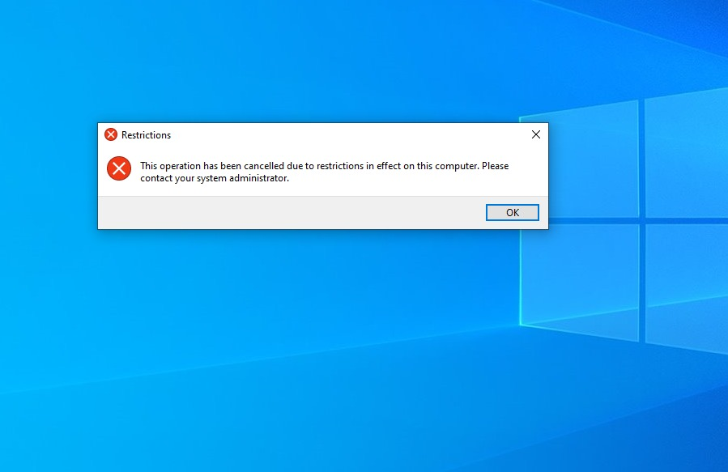
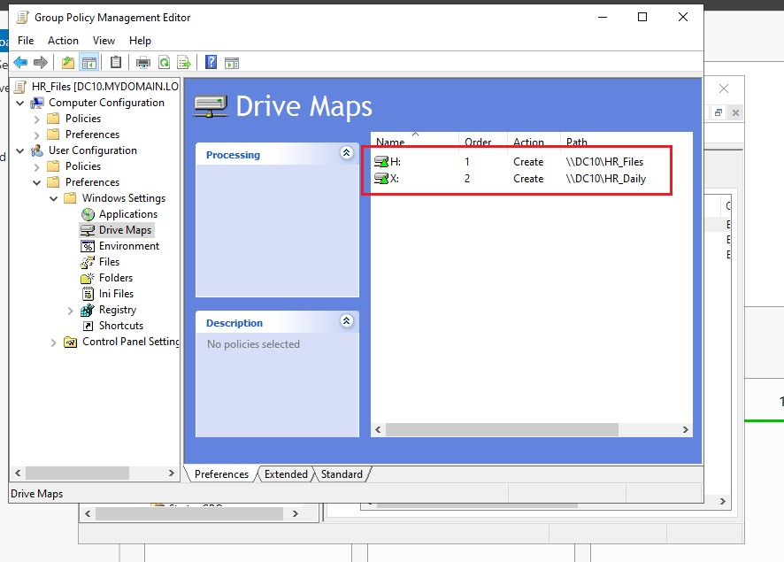
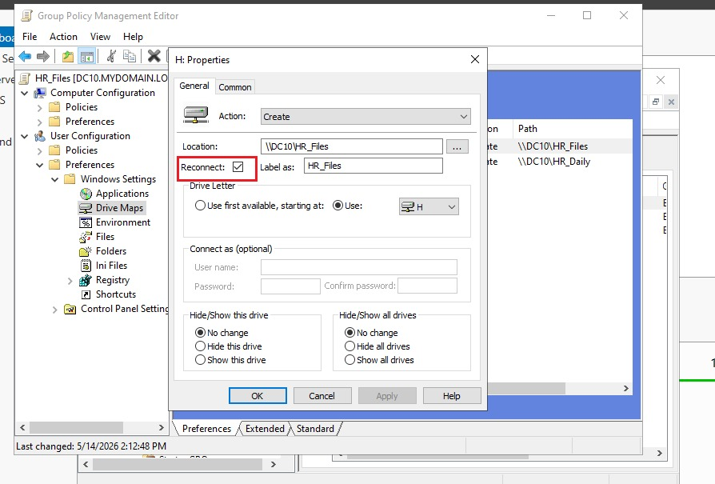
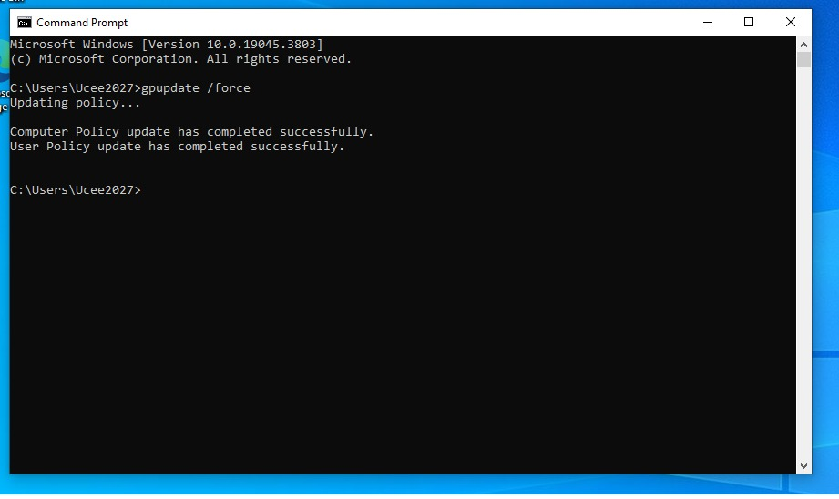
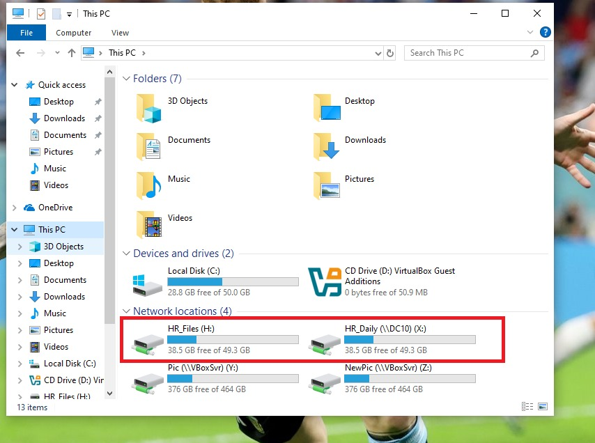
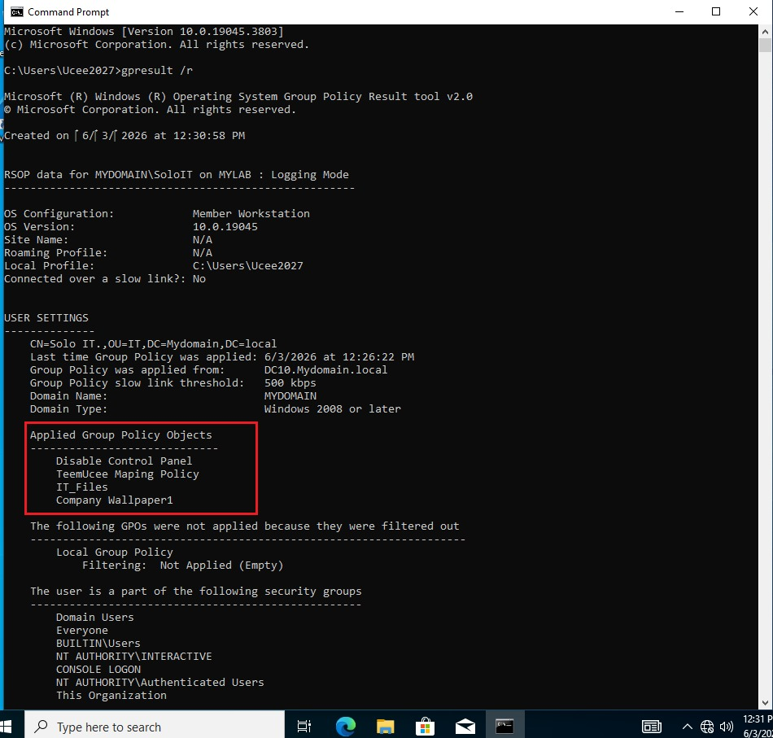

# Group Policy Administration

## Project Overview

This project demonstrates the implementation and management of Group Policy Objects (GPOs) within an Active Directory environment. The objective was to centrally manage user settings, enforce security restrictions, deploy network resources, and validate policy application across domain joined workstations.

### Environment

### Infrastructure

| Component	| Description |
|---------------|--------------------------|
| Domain Controller	| DC10 |
|Operating System	| Windows Server 2022 |
| Domain	| mydomain.local |
| Client Workstation	| WorkLab |
| Active Directory	| Configured |
| Group Policy Management	| Configured |

## Step 1 Create Organizational Unit

An Organizational Unit (OU) was created to provide a target location for policy deployment.

### OU Created

- HR_Teams
- IT_Admins
- IT

### Purpose

The OU was used to organize users and simplify Group Policy administration.

### Screenshot

## Step 2 Create Group Policy Object (GPO)

A new Group Policy Object was created using Group Policy Management.

### Tasks Performed

- Opened Group Policy Management
- Created new GPO
- Assigned descriptive name

### Example GPO

Disable Control Panel

### Purpose

The policy was created to enforce workstation restrictions for specific users.

### Screenshot

## Step 3 Link GPO to Organizational Unit

The Group Policy Object was linked to the IT Organizational Unit.

### Tasks Performed

- Selected IT OU
- Linked existing GPO
- Verified successful linkage

### Purpose

Linking determines where the policy is applied.

### Screenshot

## Step 4 Disable Control Panel

A User Configuration policy was configured to prevent access to Control Panel.

### Policy Path

User Configuration
- Administrative Templates
- Control Panel
- Prohibit access to Control Panel and PC settings

### Action
Policy was enabled.

### Purpose

Restricts users from modifying workstation settings.

### Screenshot

## Step 5 Restrict Access to PC Settings

The policy was configured to block access to Windows Settings.

### Result

Users were unable to open:
- Control Panel
- Settings App

### Screenshot

## Step 6 Configure Drive Mapping

A network drive was deployed using Group Policy Preferences.

### Tasks Performed

- Opened Group Policy Management Editor
- Navigated to Drive Maps
- Created mapped network drive

### Example Path

\\DC10\HR_Files

### Drive Letter

H:

### Purpose
Provides automatic access to shared resources.

### Screenshot

## Step 7 Configure Reconnect Option

The Reconnect option was enabled for the mapped drive.

### Purpose
Ensures the mapped drive reconnects automatically whenever users sign in.

### Result

Users retain access to shared resources after logoff and restart.

### Screenshot

## Step 8 Apply Group Policy Updates

Policy updates were forced on the client workstation.

### Command Used

gpupdate /force

## Purpose

Refreshes Group Policy settings immediately.

### Screenshot

## Step 9 Verify Policy Application

Policy deployment was tested on the client workstation.

## Validation

Verified:
- Control Panel inaccessible
- Settings restricted
- Network drive mapped successfully

## Result

Policies applied successfully.

### Screenshot

## Step 10 Verify Applied Policies

Group Policy results were reviewed.

## Command Used

gpresult /r

## Purpose

Confirms policies applied to the user and workstation.

### Screenshot

### Project Outcome

Successfully implemented centralized management using Group Policy Objects within an Active Directory environment.

The implementation provided:

- Centralized policy management
- User restriction enforcement
- Automated network drive deployment
- Consistent workstation configuration
- Simplified administrative control.

